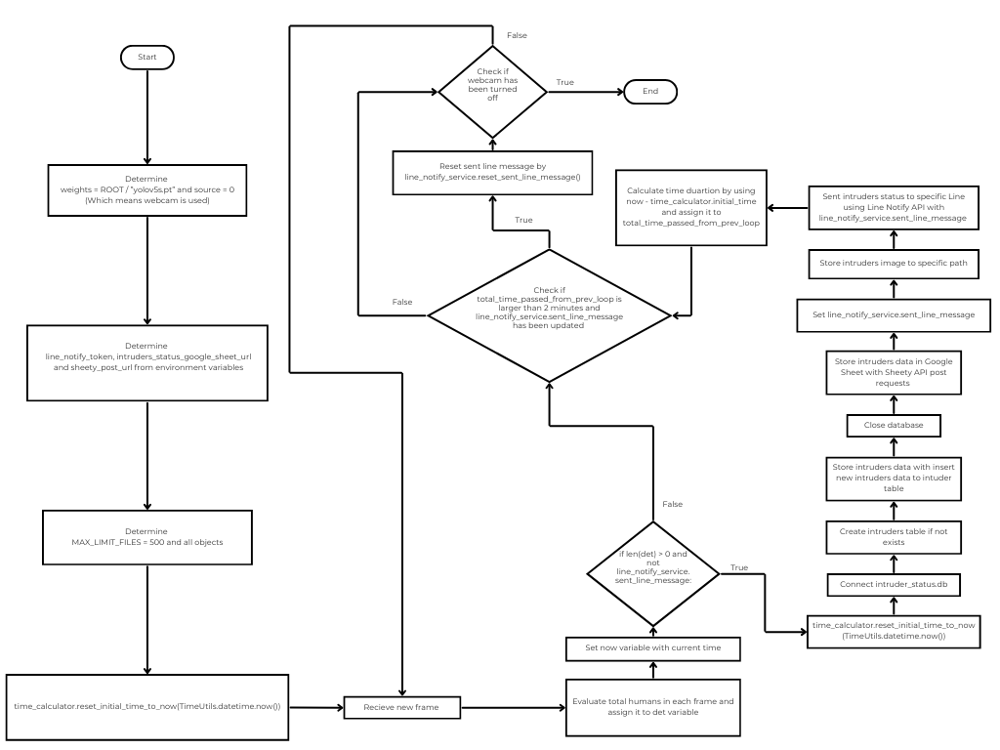

# Human-Detect-for-Counting
**Human-Detect-for-Counting** is a project that utilize open-source *YOLOv5* model, utilizing a Python detection script to detect intruders frame by frame. Afterward, the system sends notification and store the data in both *Google Sheet* and *database file*.

The project utilize the *YOLOv5s* because it is a smallest size compared to other sizes and compatibility with various projects such as embeded systems that have limited processing power.

For more information of YOLOv5, please visit *[YOLOv5 repository here](https://github.com/ultralytics/yolov5)* 

## Overview
This project uses the existing `detect.py` script from the *YOLOv5* repository, developed with a custom Python script to sent notification and store data upon human detection.

The project is executed via `detect.py` script. The script utilize computer's default camera to perform human detection. If humans are found notification is sent via Line Notify. Moreover, the detection data is stored using the *Sheety API* and *SQLite3* DBMS to store data in *Google Sheet* and database file.

## Important Files.

1. `create_prepared_pt_file.py` used to create specific yolov5 size model file.

2. `detect.py` used to perform intruders detection.

## API
This project utilize 2 APIs to store and notify users for intruders detection.

- *Sheety API* used for connect Google Sheet, allowing the script to read, edit, delete or insert data to specific Google Sheet. Visit *[Sheety API website here](https://sheety.co/)*.

- *Line Notify* used for sending message, image and stickers to specific Line group or users. Visit *[Line Notify website here](https://notify-bot.line.me/)*.

## Data Storage
This project stores detection data in *Google Sheet* and *database*.

- *Google Sheet* store intruders data in a table format features the number of intruders  that were found along with found date and time.

- *Database* is similar to the *Google Sheet*. the number of intruders along with found date and time column are required for database recording.
## Diagram


## Usage
Before execute the project, a few setup is required.

### Initial Setup
1. **Install `requirements.txt`** for required packages.
    ```Bash
    pip install -r requirements.txt
    ```

2. **Ensure that `yolov5s.pt` model is available.** If the model is not installed, execute `create_prepared_pt_file.py` file.
    ```Bash
    python create_prepared_pt_file.py
    ```

3. **Set up `weights` and `source` parameter** in `detect.py`.
    ```Python
    def run(
        weights=ROOT / 'yolov5s.pt',  # model path or triton URL
        source=ROOT / 'data/images',  # file/dir/URL/glob/screen/0(webcam)
        data=ROOT / 'data/coco128.yaml',  # dataset.yaml path
        imgsz=(640, 640),  # inference size (height, width)
        conf_thres=0.25,  # confidence threshold
        iou_thres=0.45,  # NMS IOU threshold
        max_det=1000,  # maximum detections per image
        device='',  # cuda device, i.e. 0 or 0,1,2,3 or cpu
        view_img=False,  # show results
        save_txt=False,  # save results to *.txt
        save_csv=False,  # save results in CSV format
        save_conf=False,  # save confidences in --save-txt labels
        save_crop=False,  # save cropped prediction boxes
        nosave=False,  # do not save images/videos
        classes= '',  # filter by class: --class 0, or --class 0 2 3
        agnostic_nms=False,  # class-agnostic NMS
        augment=False,  # augmented inference
        visualize=False,  # visualize features
        update=False,  # update all models
        project=ROOT / 'runs/detect',  # save results to project/name
        name='exp',  # save results to project/name
        exist_ok=False,  # existing project/name ok, do not increment
        line_thickness=3,  # bounding box thickness (pixels)
        hide_labels=False,  # hide labels
        hide_conf=False,  # hide confidences
        half=False,  # use FP16 half-precision inference
        dnn=False,  # use OpenCV DNN for ONNX inference
        vid_stride=1,  # video frame-rate stride
    ):
    ```
    In the `parse_opt` function, set `weight` to `0` and `source` to `yolov5s.pt`.
    ```Python
    def parse_opt():
        parser = argparse.ArgumentParser()
        parser.add_argument('--weights', nargs='+', type=str, default=ROOT / 'yolov5s.pt', help='model path or triton URL')
        parser.add_argument('--source', type=str, default= 0, help='file/dir/URL/glob/screen/0(webcam)')
    ```

4. **Line Notify setup** is required. Log in to *Line Notify* official website and obtain *Line Notify token* and assign it into `line_notify_token` in `detect.py` as an environment variable.
    ```Python
    line_notify_token = os.environ.get("line_notify_token")
    ```

5. **Google Sheet url** must be provided as environment variable.
    ```Python
    intruders_status_google_sheet_url = os.environ.get("intruders_status_google_sheet_url")
    ```

6. **Determine `MAX_LIMIT_FILES`** in `detect.py` which is the maximum of image files that can be stored in each directory.
    ```Python
    MAX_LIMIT_FILES = 500 
    ```

### Custom Setup
There are some variable that is flexible to be adjusted by users.

1. `MAX_LIMIT_FILES` in `detect.py` is flexible to adjust by purpose. Modify this variable to determine the maximum number of image files stored in each directory.
    ```Python
    MAX_LIMIT_FILES = 100
    ```

2. `model` in `create_prepared_pt_file.py` can be adjusted.
    ```Python
    model = "yolov5l"
    ```

    Ensure you also change the model to other models when you change your model from `yolov5s`. Update the `weights` parameter in `detect.py`
    ```Python
    def run(
        weights=ROOT / 'yolov5l.pt',  # model path or triton URL
        source=ROOT / 'data/images',  # file/dir/URL/glob/screen/0(webcam)
        data=ROOT / 'data/coco128.yaml',  # dataset.yaml path
        imgsz=(640, 640),  # inference size (height, width)
        conf_thres=0.25,  # confidence threshold
        iou_thres=0.45,  # NMS IOU threshold
        max_det=1000,  # maximum detections per image
        device='',  # cuda device, i.e. 0 or 0,1,2,3 or cpu
        view_img=False,  # show results
        save_txt=False,  # save results to *.txt
        save_csv=False,  # save results in CSV format
        save_conf=False,  # save confidences in --save-txt labels
        save_crop=False,  # save cropped prediction boxes
        nosave=False,  # do not save images/videos
        classes= '',  # filter by class: --class 0, or --class 0 2 3
        agnostic_nms=False,  # class-agnostic NMS
        augment=False,  # augmented inference
        visualize=False,  # visualize features
        update=False,  # update all models
        project=ROOT / 'runs/detect',  # save results to project/name
        name='exp',  # save results to project/name
        exist_ok=False,  # existing project/name ok, do not increment
        line_thickness=3,  # bounding box thickness (pixels)
        hide_labels=False,  # hide labels
        hide_conf=False,  # hide confidences
        half=False,  # use FP16 half-precision inference
        dnn=False,  # use OpenCV DNN for ONNX inference
        vid_stride=1,  # video frame-rate stride
    ):
    ```
    Set `weight` in `parse_opt` function.
    ```Python
    def parse_opt():
        parser = argparse.ArgumentParser()
        parser.add_argument('--weights', nargs='+', type=str, default=ROOT / 'yolov5l.pt', help='model path or triton URL')
    ```

3. In `TimeUtils.timedelta(minutes = 2, seconds = 0)` in `detect.py` is the duration for message. This variable can be adjusted.

    ```Python
    if line_notify_service.sent_line_message and total_time_passed_from_prev_loop > TimeUtils.timedelta(minutes = 1, seconds = 0):
        ...
    ```

### Execute Project.
Once the **Initial Setup** is provided, you can start execute project by following command.
```Bash
python detect.py
```

  